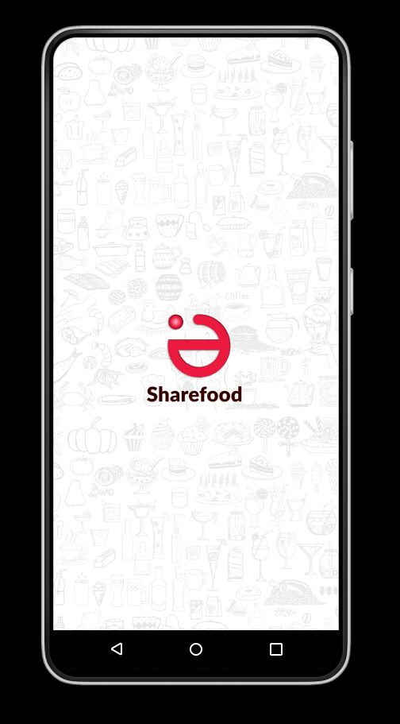

# shareFood_mobile
Share Food mobile app  

 

### Team members 
- [Festus](https://github.com/festgo12).
- [Petec ](https://github.com/Petec0x0).

## CODE OF CONDUCT
- comment code as much as possible.
- use Camel casing naming convention. 
- all development is done on the dev branch of the repo (no pushing to main).
- use feature branching when working on new features before merging to dev branch.
- commit codes as much as possible (2-3days atleast).
- seek help if confused of any part of the project.
 
